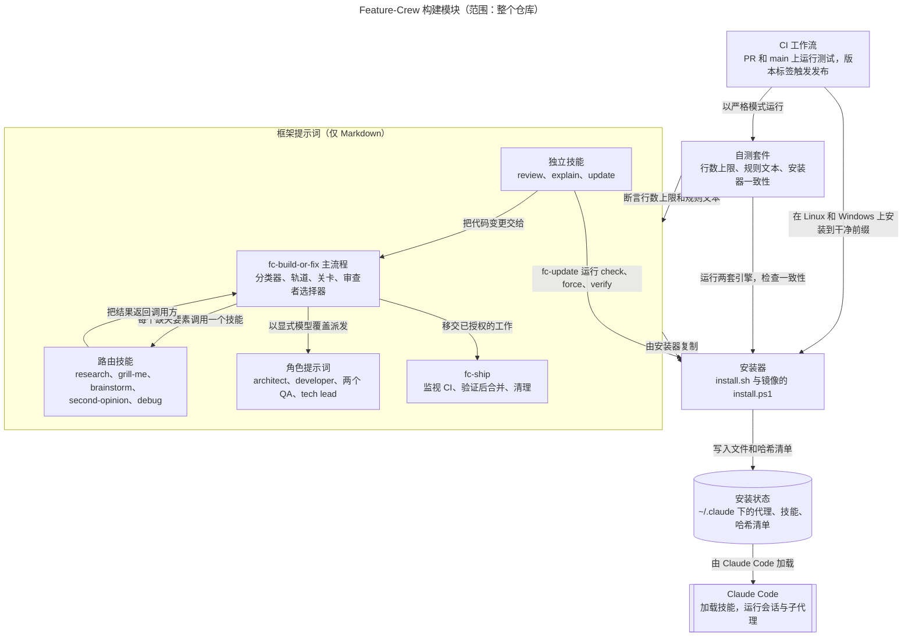
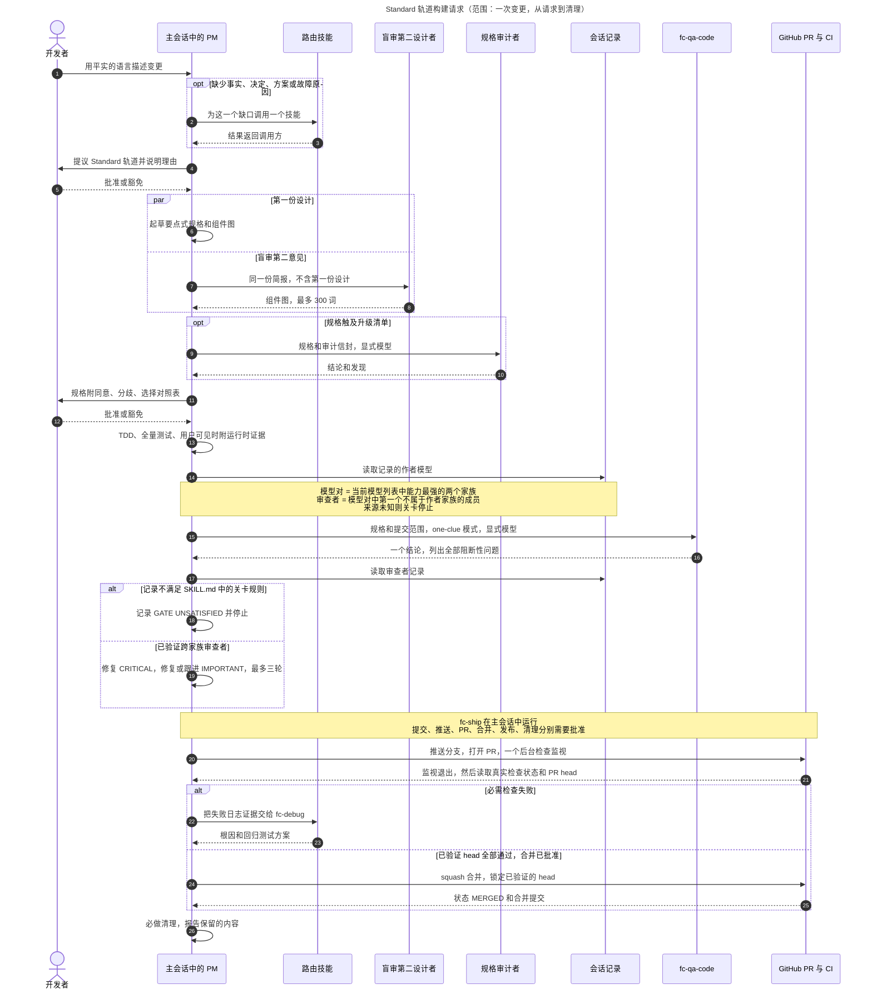

# 架构

[English](Architecture)

Feature-Crew 是一组供 Claude Code 使用的 Markdown 提示词，不是一个运行中的服务。一个主流程技能 `fc-build-or-fix` 让主会话担任 PM（产品经理）。PM 把每个缺失要素交给一个辅助技能，派发角色子代理，并把每个硬性关卡产物交给另一模型家族的审查者，审查者的身份由会话记录证明。完成的工作交给 `fc-ship`。两个安装器把提示词复制到 `~/.claude`，一个 bash 测试套件和 CI 检查提示词的大小、规则文本，以及两个安装器是否一致。

范围：v5.2.1 时的整个仓库，聚焦于构建路径。图用 `/fc-explain` 绘制；每个节点和箭头都能追溯到图后表格中的文件。CI、发布和本 wiki 的发布方式见[开发与发布](Development-and-Release-zh-CN)。

## 构建模块

**图例：** 矩形是本仓库中的一组文件，圆柱是用户磁盘上已安装的文件，双边框的方框是外部系统。箭头表示控制流或文件流；每个标签说明沿途发生的事。

**要点：** Claude Code 运行的一切都是 Markdown，`fc-build-or-fix` 是枢纽。路由技能和角色提示词为它服务，它完成后由 `fc-ship` 接手。安装器、测试套件和 CI 负责交付和检查提示词；处理请求时它们都不运行。

**逐步说明**

1. **独立技能把代码变更交给枢纽。** `fc-update` 先拉取，再驱动安装器：`--check`、`--force`，然后 `--verify`。
2. **枢纽一次路由一个缺失要素。** 单个事实直接查找。多处证据交给 `fc-research`，用户拥有的决定交给 `fc-grill-me`，未定的方案交给 `fc-brainstorm`，已选定的重大决定交给 `fc-second-opinion`，无法解释的故障交给 `fc-debug`。每个技能都把结果返回调用方。只有 `fc-grill-me` 可以在另一个技能内部被调用，同一个缺口从不被路由两次。
3. **枢纽派发角色提示词**：任务文本内联粘贴，带显式模型覆盖，并以一行禁止进一步委派的话收尾。
4. **已授权的工作交给 `fc-ship`。**
5. **安装器把提示词复制到 `~/.claude`。** 它们为代理添加 `name` 和 `description` frontmatter，并为五个被派发的角色添加 `disallowedTools: Agent, Skill`，同时记录 `feature-crew.sha256`。`install.ps1` 能交给 Git Bash 时就交给它，否则运行它自己的、逻辑相同的 PowerShell 版本。
6. **Claude Code 从 `~/.claude/agents` 和 `~/.claude/skills` 加载已安装的文件。** 它如何发现这些文件属于 Claude Code 的行为，不是本仓库的代码。
7. **测试套件和 CI 检查两半：** 行数上限、带删除变异的规则文本、安装器一致性以及 PowerShell 引擎，全部在 `FC_STRICT=1` 下运行。

| 组件 | 职责 | 关键文件 | 证据 |
|---|---|---|---|
| fc-build-or-fix 主流程 | 让主会话担任 PM：对需求分类、选择轨道并执行、执行硬性关卡、选择审查者。进入时加载运行纪律（反馈检查、检查点、运行时证据）。`fc-pm.md` 只指向这里。 | [SKILL.md][bof], [reference/][ref], [fc-pm.md][pm] | SKILL.md：*Need classifier*、*Step 1*、*Hard gates*、*Cross-family audit at hard gates*；[run-discipline.md][run] |
| 路由技能 | 各自解决一个缺失要素并把结果返回调用方；`fc-research` 还有一条针对单个有界问题的聚焦路径 | [research][research], [grill-me][grill], [brainstorm][brain], [second-opinion][second], [debug][debug] | SKILL.md：*Need classifier*；fc-research：*Focused path* |
| 角色提示词 | 子代理简报：architect 写计划（≤500 行），developer 完成一个 TDD 任务，`fc-qa-spec` 和 `fc-qa-code` 各返回一个列出全部阻断性问题的结论，tech lead 整体审查 Complex 工作。五个角色安装时都带 `disallowedTools: Agent, Skill` | [agents/][agents] | [complex-track.md][complex]：*Flow* |
| fc-ship | 分别请求每项批准，运行一个后台 CI 监视，只 squash 合并已验证的 head，可选发布，并总是清理 | [SKILL.md][ship] | fc-ship：第 1–7 节 |
| 独立技能 | 可选的审查、图示和重装，不在构建路径上 | [fc-review][review], [fc-explain][explain], [fc-update][update] | 各技能的描述或相关技能列表；fc-update 第 2–6 步 |
| 安装器 | 复制代理（添加 frontmatter）和每个技能目录，记录哈希，只删除能证明属于自己的文件；`--check` 和 `--verify` 是只读的 | [install.sh][sh], [install.ps1][ps1], [published.sha256][pub] | [使用说明](Usage-zh-CN)：*安装* |
| 安装状态 | 代理、技能和安装清单 | `~/.claude/agents/fc-*.md`、`~/.claude/skills/fc-*/`、`~/.claude/feature-crew.sha256` | [使用说明](Usage-zh-CN)：*安装*；[install.sh][sh] 写明了清单文件名 |
| Claude Code | 加载技能（推断），运行会话和子代理，保存会话记录 | 不在本仓库中 | [gate-provenance.md][prov]：*Read the record* |
| 自测套件 | 仅供开发的 bash 检查，任何失败都以非零状态退出；`FC_STRICT=1` 把跳过的检查变成失败 | [framework_test.sh][suite] | 套件的文件头 |
| CI 工作流 | 运行测试套件和干净前缀安装，发布本 wiki，并发布版本 | [.github/workflows/][wf] | [开发与发布](Development-and-Release-zh-CN) |

## 关键流程：一次 Standard 构建请求

**图例：** 小人是一个人，方框是软件参与者。实线箭头是请求或动作；虚线箭头是回复。`opt`、`alt` 和 `par` 标记可选、分支和并行步骤。编号与逐步说明对应。

**要点：** 一次 Standard 请求要经过三个用户检查点：轨道、规格，以及每个交付步骤。它还需要两项任何批准都无法豁免的证明：粘贴的全量测试输出，以及由另一模型家族的审查者检查的规格符合性，其中家族来自会话记录，而不是请求的模型名。

**逐步说明**

- **1–3 进入。** `CLAUDE.md` 让主流程成为任何构建、修复或变更的第一步。PM 自己查找单个事实，把其他任何缺口交给恰好一个技能。
- **4–5 轨道。** Standard 适合一个连贯的功能。变更触及升级清单时排除 Just Do It：运行时行为、配置、认证、密钥、持久化、公共 API 或部署行为。
- **6–12 规格。** 要点式规格列出目的、文件、组件图、3–8 条行为、必须通过的测试命令和非目标。盲审第二设计者拿到同一份简报但不含第一份设计，最多返回 300 词，规格记录同意、分歧、选择对照表；只有“极其简单直接”的设计才跳过它。触及升级清单的规格在用户批准前由另一家族的审查者审计。
- **13 构建。** 写失败的测试，观察失败，写最少的代码，观察通过，重构；然后运行全量测试并粘贴输出，用户可见的变更还要附运行时证据。
- **14–19 关卡。** 作者的家族来自会话记录中记录的模型，而不是请求的别名。`fc-qa-code` 以 one-clue 模式审查规格符合性和代码。审查者的记录是否满足关卡，只由 [SKILL.md][bof] 中的规范规则（*Cross-family audit at hard gates*）决定；没有回退。CRITICAL 必须修复；IMPORTANT 修复或跟进；最多三轮修复。
- **20–26 交付。** `fc-ship` 在一个问题里请求所有缺失的批准，推送，并运行一个后台 `gh pr checks --watch`。失败交给 `fc-debug`，并在构建关卡下修复。合并前它重新检查 head 并确认其包含 base；用 `--match-head-commit` 合并，然后确认状态为 MERGED 且合并后的树等于 head 的树。清理总会执行。

| 参与者 | 在此流程中的职责 | 关键文件 |
|---|---|---|
| 开发者 | 陈述需求；批准或豁免轨道和规格；批准每个交付步骤 | — |
| 主会话中的 PM | 运行主流程，然后运行 `fc-ship`；编写规格，在 Standard 中也编写代码；选择并验证审查者 | [fc-build-or-fix][bof], [fc-ship][ship] |
| 路由技能 | 填补一个缺口；`fc-debug` 还负责诊断 CI 失败 | [fc-debug][debug] 以及其他路由技能 |
| 盲审第二设计者 | 根据同一份简报独立给出组件图，只做一轮 | [design-check.md][design] |
| 规格审计者 | 审查触及升级清单的规格 | [SKILL.md][bof]：*Standard*，第 3 步 |
| 会话记录 | 证明哪个模型作答的唯一可接受证据 | [gate-provenance.md][prov] |
| fc-qa-code | Standard 的规格与代码合并审查，给出一个结论 | [fc-qa-code.md][qacode] |
| GitHub PR 与 CI | 目标项目的 PR 和检查，用 `gh` 驱动 | [fc-ship][ship] |

**其他轨道**

| 轨道 | 与 Standard 的区别 |
|---|---|
| Just Do It | 自动选择。不需要批准、规格、派发或 QA，但仍要先写失败的测试并粘贴验证结果；如果探查发现风险，就升级为 Standard。 |
| Complex | 一份经过交叉审计的规格文档（≤1000 词）；由 `fc-architect` 写的计划（≤500 行），附盲审第二设计、计划审计和批准；每个任务一个 `fc-developer`，只有在三个或更多独立任务时才并行；每个任务都有 `fc-qa-spec` 和 `fc-qa-code`；合并前需要 `fc-tech-lead` 批准。见 [complex-track.md][complex]。 |
| 对 Feature-Crew 本身的修改 | 最多 Standard，并遵守行数上限。见 [meta-work-cap.md][meta]。 |

## 硬性关卡与原则

以下关卡在满足前阻止继续推进：

1. Standard 和 Complex 的轨道批准，除非已豁免
2. Standard 和 Complex 的规格批准，除非已豁免
3. Complex 的计划批准，除非已豁免
4. 每个完成声明都有观察到的验证证据
5. 实现与批准的规格一致
6. 合并 Complex 工作前需要 Tech Lead 批准

验证、规格符合性和 Complex 的 Tech Lead 批准不能豁免。文件数只是警告信号：跨多个文件的低风险镜像修改可以是 Just Do It，而一行的运行时、配置、API 或部署修改不能。规范的关卡、升级清单和审查者规则在 [fc-build-or-fix SKILL.md][bof] 中；本节只做概括。

在每个轨道上都成立的原则：

- **TDD**：没有先观察到失败的测试，就不写生产代码；文档先写客观的验收检查。
- **先验证再声明**：粘贴输出，不要描述输出。
- **根因优先**：三次修复失败就要重新思考。
- **不猜测**：事实去查，决定去问。
- **YAGNI**：只构建被要求的东西。
- **跨平台一致**：`install.sh` 和 `install.ps1` 一起发布。

## 已验证事实、推断与未知项

**已在仓库中验证**

- Claude Code 运行的一切都是 Markdown：十个技能、五个参考文件和六个角色提示词。代码是两个安装器、测试套件、CI 工作流，以及 wiki 发布器和检查器。
- 角色提示词不带 `model` 键。安装器添加 `name` 和 `description`，并为五个被派发的角色添加 `disallowedTools: Agent, Skill`；每次编写或审查派发都显式设置模型。
- 关卡失败即关闭：来源未知会让关卡不满足，单独运行的 `/fc-review` 或 `/fc-second-opinion` 不能替代关卡。
- 套件的规则文本检查只能证明规则存在，不能证明其含义；套件的文件头就是这么说的。
- 编排层（`fc-pm.md` 加上每个 `SKILL.md`）上限 600 行，框架总量上限 1500 行并低于棘轮基线。

**推断**

- 在本仓库之外，只有当 Claude Code 把某个平实语言请求匹配到主流程的描述时，请求才会到达主流程。仓库只能表明这一意图，无法强制。
- 在 Standard 中，PM 会话自己编写代码：构建步骤没有指定 developer，2–3 次派发的预算正好对应第二设计者、可选的规格审计和 `fc-qa-code`。
- Claude Code 会在 `~/.claude/agents` 和 `~/.claude/skills` 下发现文件。

**未知**

- 由哪种代理类型运行盲审第二设计者；`design-check.md` 没有指定。
- 模型是否遵循这些提示词：套件检查的是提示词文本和安装器，不是真实运行。
- 会话记录的字段是否一直准确；`gate-provenance.md` 称之为内部的、未公开的格式。
- 如果 `fc-pm` 仍被作为子代理派发会怎样：安装器把它注册为代理，而它的描述和提示词说它只作为主会话运行。
- Claude Code 是否执行 `disallowedTools`：一份仍未关闭的上游报告 [anthropics/claude-code#94202](https://github.com/anthropics/claude-code/issues/94202) 说列出的工具仍可能加载，所以每个关卡上的会话记录检查仍是真正起作用的控制。

## 从哪里开始阅读

1. [fc-build-or-fix SKILL.md][bof]：约 125 行的完整控制模型。
2. [run-discipline.md][run]、[design-check.md][design]，然后是 [gate-provenance.md][prov]。
3. [complex-track.md][complex]：完整流水线，附一个实际示例。
4. [fc-qa-code.md][qacode] 和 [fc-developer.md][dev]：被派发的角色收到什么、返回什么。
5. [fc-ship SKILL.md][ship]：合并路径。
6. [install.sh][sh]，然后是 [framework_test.sh][suite] 的开头：提示词如何交付，以及通过的测试套件能证明和不能证明什么。

[bof]: https://github.com/D0n9X1n/feature-crew/blob/main/.claude/skills/fc-build-or-fix/SKILL.md
[ref]: https://github.com/D0n9X1n/feature-crew/tree/main/.claude/skills/fc-build-or-fix/reference
[run]: https://github.com/D0n9X1n/feature-crew/blob/main/.claude/skills/fc-build-or-fix/reference/run-discipline.md
[design]: https://github.com/D0n9X1n/feature-crew/blob/main/.claude/skills/fc-build-or-fix/reference/design-check.md
[prov]: https://github.com/D0n9X1n/feature-crew/blob/main/.claude/skills/fc-build-or-fix/reference/gate-provenance.md
[complex]: https://github.com/D0n9X1n/feature-crew/blob/main/.claude/skills/fc-build-or-fix/reference/complex-track.md
[meta]: https://github.com/D0n9X1n/feature-crew/blob/main/.claude/skills/fc-build-or-fix/reference/meta-work-cap.md
[pm]: https://github.com/D0n9X1n/feature-crew/blob/main/agents/fc-pm.md
[agents]: https://github.com/D0n9X1n/feature-crew/tree/main/agents
[dev]: https://github.com/D0n9X1n/feature-crew/blob/main/agents/fc-developer.md
[qacode]: https://github.com/D0n9X1n/feature-crew/blob/main/agents/fc-qa-code.md
[research]: https://github.com/D0n9X1n/feature-crew/blob/main/.claude/skills/fc-research/SKILL.md
[grill]: https://github.com/D0n9X1n/feature-crew/blob/main/.claude/skills/fc-grill-me/SKILL.md
[brain]: https://github.com/D0n9X1n/feature-crew/blob/main/.claude/skills/fc-brainstorm/SKILL.md
[second]: https://github.com/D0n9X1n/feature-crew/blob/main/.claude/skills/fc-second-opinion/SKILL.md
[debug]: https://github.com/D0n9X1n/feature-crew/blob/main/.claude/skills/fc-debug/SKILL.md
[ship]: https://github.com/D0n9X1n/feature-crew/blob/main/.claude/skills/fc-ship/SKILL.md
[review]: https://github.com/D0n9X1n/feature-crew/blob/main/.claude/skills/fc-review/SKILL.md
[explain]: https://github.com/D0n9X1n/feature-crew/blob/main/.claude/skills/fc-explain/SKILL.md
[update]: https://github.com/D0n9X1n/feature-crew/blob/main/.claude/skills/fc-update/SKILL.md
[sh]: https://github.com/D0n9X1n/feature-crew/blob/main/install.sh
[ps1]: https://github.com/D0n9X1n/feature-crew/blob/main/install.ps1
[pub]: https://github.com/D0n9X1n/feature-crew/blob/main/published.sha256
[suite]: https://github.com/D0n9X1n/feature-crew/blob/main/tests/framework_test.sh
[wf]: https://github.com/D0n9X1n/feature-crew/tree/main/.github/workflows
