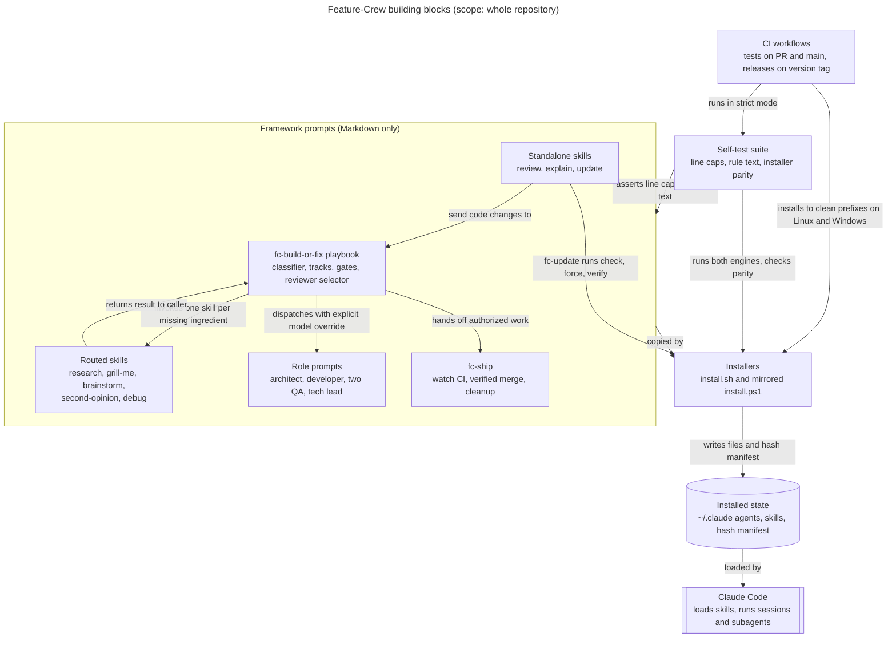
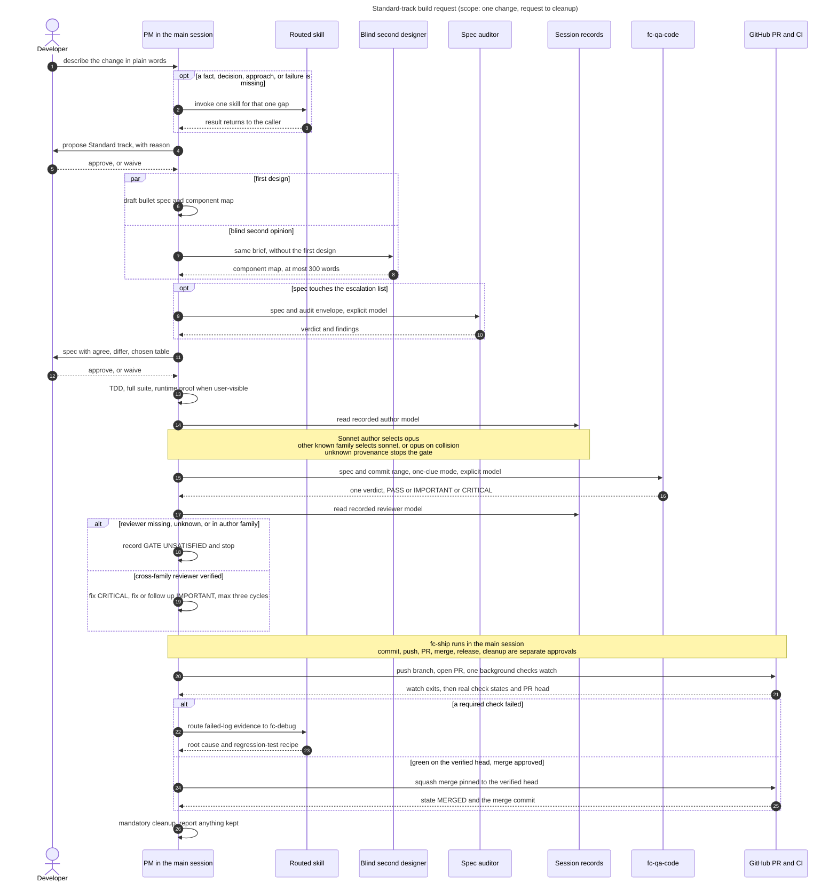

# Architecture

Feature-Crew is a set of Markdown prompts for Claude Code, not a running service. One playbook skill, `fc-build-or-fix`, makes the main session the PM (product manager). The PM routes each missing ingredient to one helper skill, dispatches role subagents, and sends every hard-gate artifact to a reviewer from another model family, proven from the session transcript. Finished work goes to `fc-ship`. Two installers copy the prompts into `~/.claude`, and a bash suite plus CI check the prompts' size and rule text and that the two installers match.

Scope: the whole repository at v5.2.0, focused on the build path. The diagrams were drawn with `/fc-explain`; each node and arrow traces to the files in the table after its diagram. CI, releases, and this wiki's publishing are on [Development and Release](Development-and-Release).

## Building blocks

**Legend:** a rectangle is a group of files in this repository, the cylinder is installed files on the user's disk, and the double-bordered box is an external system. Arrows show control or file flow; each label says what happens along it.

**Takeaway:** everything Claude Code runs is Markdown, and `fc-build-or-fix` is the hub. Routed skills and role prompts feed it, and `fc-ship` takes over when it finishes. The installers, the suite, and CI ship and check the prompts; none of them runs while a request is handled.

**Walkthrough**

1. **Standalone skills send code changes to the hub.** `fc-update` pulls, then drives the installer: `--check`, `--force`, then `--verify`.
2. **The hub routes one missing ingredient at a time.** A single fact is looked up directly. Evidence from several places goes to `fc-research`, a user-owned decision to `fc-grill-me`, an open approach to `fc-brainstorm`, a chosen consequential decision to `fc-second-opinion`, and an unexplained failure to `fc-debug`. Each returns its result to the caller. Only `fc-grill-me` may be called from inside another skill, and the same gap is never routed twice.
3. **The hub dispatches role prompts** with the task text pasted inline, an explicit model override, and a closing line that forbids further delegation.
4. **Authorized work goes to `fc-ship`.**
5. **The installers copy the prompts into `~/.claude`.** They add `name` and `description` frontmatter to agents and record `feature-crew.sha256`. `install.ps1` hands off to Git Bash when it can and otherwise runs its own PowerShell copy of the same logic.
6. **Claude Code loads the installed files** from `~/.claude/agents` and `~/.claude/skills`. How it discovers them is Claude Code behavior, not code in this repository.
7. **The suite and CI check both halves:** line caps, rule text with removal mutations, installer parity, and the PowerShell engine, all under `FC_STRICT=1`.

| Component | Job | Key files | Evidence |
|---|---|---|---|
| fc-build-or-fix playbook | Makes the main session the PM: classifies the need, picks a track, runs it, enforces the hard gates, and selects reviewers. Loads run discipline (feedback checks, a checkpoint, runtime proof) at entry. `fc-pm.md` only points here. | [SKILL.md][bof], [reference/][ref], [fc-pm.md][pm] | SKILL.md: *Need classifier*, *Step 1*, *Hard gates*, *Cross-family audit at hard gates*; [run-discipline.md][run] |
| Routed skills | Each resolves one missing ingredient and returns it to the caller; `fc-research` also has a focused path for one bounded question | [research][research], [grill-me][grill], [brainstorm][brain], [second-opinion][second], [debug][debug] | SKILL.md: *Need classifier*; fc-research: *Focused path* |
| Role prompts | Subagent briefs: the architect writes a plan (≤500 lines), the developer does one TDD task, `fc-qa-spec` and `fc-qa-code` return one-clue verdicts, and the tech lead reviews Complex work as a whole | [agents/][agents] | [complex-track.md][complex]: *Flow* |
| fc-ship | Asks for each approval separately, runs one background CI watch, squash-merges only the verified head, optionally releases, and always cleans up | [SKILL.md][ship] | fc-ship: sections 1–7 |
| Standalone skills | Opt-in review, diagrams, and reinstall, outside the build path | [fc-review][review], [fc-explain][explain], [fc-update][update] | each skill's description or related-skills list; fc-update steps 2–6 |
| Installers | Copy agents (adding frontmatter) and every skill directory, record hashes, and delete only files proven to be theirs; `--check` and `--verify` are read-only | [install.sh][sh], [install.ps1][ps1], [published.sha256][pub] | [README][readme]: *Install* |
| Installed state | The agents, skills, and install manifest | `~/.claude/agents/fc-*.md`, `~/.claude/skills/fc-*/`, `~/.claude/feature-crew.sha256` | [README][readme]: *Install*; [install.sh][sh] names the manifest |
| Claude Code | Loads the skills (inferred), runs the session and subagents, and records transcripts | not in this repository | [gate-provenance.md][prov]: *Read the record* |
| Self-test suite | Dev-only bash checks that exit nonzero on any failure; `FC_STRICT=1` turns skipped checks into failures | [framework_test.sh][suite] | the suite's header |
| CI workflows | Run the suite and clean-prefix installs, publish this wiki, and cut releases | [.github/workflows/][wf] | [Development and Release](Development-and-Release) |

## Key flow: a Standard build request

**Legend:** the stick figure is a person and the boxes are software participants. A solid arrow is a request or action; a dashed arrow is a reply. `opt`, `alt`, and `par` mark optional, alternative, and parallel steps. The numbers match the walkthrough.

**Takeaway:** a Standard request passes three user checkpoints: the track, the spec, and each ship step. It also needs two proofs that no approval can waive: pasted full-suite output, and spec compliance checked by a reviewer from another model family, where the family comes from the session transcript rather than the requested model name.

**Walkthrough**

- **1–3 Entry.** `CLAUDE.md` makes the playbook the first step for any build, fix, or change. The PM looks up single facts itself and sends any other gap to exactly one skill.
- **4–5 Track.** Standard fits one coherent feature. Just Do It is ruled out when the change touches the escalation list: runtime behavior, config, auth, secrets, persistence, public API, or deploy behavior.
- **6–12 Spec.** The bullet spec lists purpose, files, a component map, 3–8 behaviors, the must-pass suite command, and non-goals. A blind second designer gets the same brief without the first design and returns at most 300 words, and the spec records an agree, differ, and chosen table; only a "super straightforward" design skips it. A spec that touches the escalation list is audited by a reviewer from another family before the user approves it.
- **13 Build.** Failing test, observed failure, minimal code, observed pass, refactor; then the full suite with pasted output, and runtime proof for user-visible changes.
- **14–19 Gate.** The author's family comes from the model the transcript recorded, not the requested alias. `fc-qa-code` reviews spec compliance and code in one-clue mode. A missing, unknown, or same-family reviewer leaves the gate unsatisfied, with no fallback. CRITICAL is fixed; IMPORTANT is fixed or followed up; at most three fix cycles.
- **20–26 Ship.** `fc-ship` asks for every missing approval in one question, pushes, and runs one background `gh pr checks --watch`. A failure goes to `fc-debug` and is fixed under the build gates. Before merging it re-checks the head and confirms it contains the base; it merges with `--match-head-commit`, then confirms MERGED and that the merged tree equals the head. Cleanup always runs.

| Participant | Job in this flow | Key files |
|---|---|---|
| Developer | States the need; approves or waives the track and spec; approves each ship step | — |
| PM in the main session | Runs the playbook, then `fc-ship`; writes the spec and, in Standard, the code; selects and verifies reviewers | [fc-build-or-fix][bof], [fc-ship][ship] |
| Routed skill | Fills one gap; `fc-debug` also diagnoses CI failures | [fc-debug][debug] and the other routed skills |
| Blind second designer | An independent component map from the same brief, in one round | [design-check.md][design] |
| Spec auditor | Reviews a spec that touches the escalation list | [SKILL.md][bof]: *Standard*, step 3 |
| Session records | The only accepted proof of which model answered | [gate-provenance.md][prov] |
| fc-qa-code | Standard's combined spec and code review, one verdict | [fc-qa-code.md][qacode] |
| GitHub PR and CI | The target project's PR and checks, driven with `gh` | [fc-ship][ship] |

**Other tracks**

| Track | How it differs from Standard |
|---|---|
| Just Do It | Picked automatically. No approval, spec, dispatch, or QA, but still a failing test first and pasted verification; moves up to Standard if exploration finds risk. |
| Complex | A cross-audited spec doc (≤1000 words); a plan from `fc-architect` (≤500 lines) with a blind second design, a plan audit, and approval; `fc-developer` per task, in parallel only at three or more independent tasks; `fc-qa-spec` and `fc-qa-code` per task; `fc-tech-lead` approval before merge. See [complex-track.md][complex]. |
| Changes to Feature-Crew itself | Standard at most, within the line caps. See [meta-work-cap.md][meta]. |

## Verified facts, inferences, and unknowns

**Verified in the repository**

- Everything Claude Code runs is Markdown: ten skills, five reference files, and six role prompts. The code is the two installers, the suite, the CI workflows, and the wiki publisher.
- Role prompts carry no `model` key. The installers add only `name` and `description`, and every authoring or review dispatch sets its model explicitly.
- Gates fail closed: unknown provenance leaves a gate unsatisfied, and standalone `/fc-review` or `/fc-second-opinion` runs are not gate substitutes.
- The suite's rule-text checks prove a rule is present, not what it means; its header says so.
- Orchestration (`fc-pm.md` plus every `SKILL.md`) is capped at 600 lines, and the framework total at 1500 lines and a ratcheted baseline.

**Inferred**

- Outside this repository, a request reaches the playbook only if Claude Code matches its description to a plain-language request. The repository states that intent but cannot enforce it.
- In Standard, the PM session writes the code itself: the build step names no developer, and the 2–3 dispatch budget fits the second designer, the optional spec audit, and `fc-qa-code`.
- Claude Code discovers files under `~/.claude/agents` and `~/.claude/skills`.

**Unknown**

- Which agent type runs the blind second designer; `design-check.md` does not name one.
- Whether models follow these prompts: the suite checks prompt text and installers, not live runs.
- Whether the transcript fields stay accurate; `gate-provenance.md` calls them an internal, undocumented format.
- What `fc-pm` does when dispatched as a subagent: the installer registers it as an agent, but its prompt says it is the main session.

## Where to start reading

1. [fc-build-or-fix SKILL.md][bof]: the whole control model in about 125 lines.
2. [run-discipline.md][run], [design-check.md][design], then [gate-provenance.md][prov].
3. [complex-track.md][complex]: the full pipeline, with a worked example.
4. [fc-qa-code.md][qacode] and [fc-developer.md][dev]: what dispatched roles receive and return.
5. [fc-ship SKILL.md][ship]: the merge path.
6. [install.sh][sh], then the top of [framework_test.sh][suite]: how the prompts ship, and what a passing suite does and does not prove.

[bof]: https://github.com/D0n9X1n/feature-crew/blob/main/.claude/skills/fc-build-or-fix/SKILL.md
[ref]: https://github.com/D0n9X1n/feature-crew/tree/main/.claude/skills/fc-build-or-fix/reference
[run]: https://github.com/D0n9X1n/feature-crew/blob/main/.claude/skills/fc-build-or-fix/reference/run-discipline.md
[design]: https://github.com/D0n9X1n/feature-crew/blob/main/.claude/skills/fc-build-or-fix/reference/design-check.md
[prov]: https://github.com/D0n9X1n/feature-crew/blob/main/.claude/skills/fc-build-or-fix/reference/gate-provenance.md
[complex]: https://github.com/D0n9X1n/feature-crew/blob/main/.claude/skills/fc-build-or-fix/reference/complex-track.md
[meta]: https://github.com/D0n9X1n/feature-crew/blob/main/.claude/skills/fc-build-or-fix/reference/meta-work-cap.md
[pm]: https://github.com/D0n9X1n/feature-crew/blob/main/agents/fc-pm.md
[agents]: https://github.com/D0n9X1n/feature-crew/tree/main/agents
[dev]: https://github.com/D0n9X1n/feature-crew/blob/main/agents/fc-developer.md
[qacode]: https://github.com/D0n9X1n/feature-crew/blob/main/agents/fc-qa-code.md
[research]: https://github.com/D0n9X1n/feature-crew/blob/main/.claude/skills/fc-research/SKILL.md
[grill]: https://github.com/D0n9X1n/feature-crew/blob/main/.claude/skills/fc-grill-me/SKILL.md
[brain]: https://github.com/D0n9X1n/feature-crew/blob/main/.claude/skills/fc-brainstorm/SKILL.md
[second]: https://github.com/D0n9X1n/feature-crew/blob/main/.claude/skills/fc-second-opinion/SKILL.md
[debug]: https://github.com/D0n9X1n/feature-crew/blob/main/.claude/skills/fc-debug/SKILL.md
[ship]: https://github.com/D0n9X1n/feature-crew/blob/main/.claude/skills/fc-ship/SKILL.md
[review]: https://github.com/D0n9X1n/feature-crew/blob/main/.claude/skills/fc-review/SKILL.md
[explain]: https://github.com/D0n9X1n/feature-crew/blob/main/.claude/skills/fc-explain/SKILL.md
[update]: https://github.com/D0n9X1n/feature-crew/blob/main/.claude/skills/fc-update/SKILL.md
[sh]: https://github.com/D0n9X1n/feature-crew/blob/main/install.sh
[ps1]: https://github.com/D0n9X1n/feature-crew/blob/main/install.ps1
[pub]: https://github.com/D0n9X1n/feature-crew/blob/main/published.sha256
[readme]: https://github.com/D0n9X1n/feature-crew/blob/main/README.md
[suite]: https://github.com/D0n9X1n/feature-crew/blob/main/tests/framework_test.sh
[wf]: https://github.com/D0n9X1n/feature-crew/tree/main/.github/workflows
