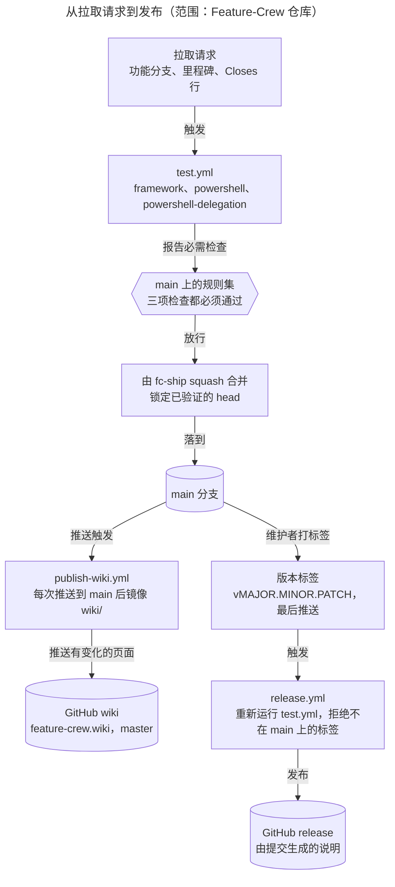

# 开发与发布

[English](Development-and-Release)

Feature-Crew 的变更如何进入 `main`、如何发布版本，以及本 wiki 如何发布。约束性规则在 [CLAUDE.md][claude] 中；本页展示流程。图用 `/fc-explain` 绘制；每个节点都能追溯到图下表格中的文件。

## 流水线



**图例：** 矩形是步骤或工作流，六边形是关卡，圆柱是 GitHub 保存的状态。箭头表示谁触发谁；每个标签说明沿途发生的事。

**要点：** `main` 之后的一切都是自动的，只有打标签除外。每次推送到 `main` 都会重新发布 wiki；只有维护者最后推送版本标签时才会发布版本，因为推送标签就等于发布。

**逐步说明**

1. **拉取请求。** 每个工作项在该版本的里程碑中有一个 issue。PR 被分配到该里程碑，并用 `Closes #N` 行关闭它的 issue。
2. **test.yml** 在每个拉取请求和每次推送到 `main` 时运行。`framework` 在 Ubuntu 上运行：带 pwsh 的严格测试套件、wiki 发布器和检查器测试，以及干净前缀的安装和卸载。`powershell` 和 `powershell-delegation` 在 Windows 上运行：PowerShell 7 和 Windows PowerShell 5.1 下的 PowerShell 安装器，以及它向 Git Bash 的交接。
3. **规则集。** 仓库规则集 "Require test workflow on main" 要求合并前三项检查都通过。
4. **合并。** `/fc-ship` 用 `--match-head-commit` 做 squash 合并，不使用管理员绕过，然后确认 PR 显示 MERGED，且合并后的树等于 head 的树。
5. **Wiki。** `publish-wiki.yml` 在每次推送到 `main` 后运行。它检出运行时的 `main`，因此重新运行旧的运行不会发布过时的页面。它用该作业的短期令牌克隆 wiki 仓库，用 `scripts/publish-wiki.sh` 从 `wiki/` 重建顶层页面，只有页面有变化时才推送到 wiki 的 `master`。运行是串行的，而且只有这个作业可以写入。
6. **发布。** 维护者给 `main` 打上 `vMAJOR.MINOR.PATCH` 标签，并最后推送标签（`git tag -a vX.Y.Z -m "vX.Y.Z" && git push origin vX.Y.Z`）。`release.yml` 重新运行 `test.yml`，拒绝不在 `main` 上的标签，并根据上一个标签以来的提交发布版本说明。这份说明就是唯一的变更日志。

| 组件 | 职责 | 关键文件 | 证据 |
|---|---|---|---|
| test.yml | 每个 PR 和每次推送到 `main` 的必需检查 | [test.yml][test] | 触发器 `push`（main）、`pull_request`、`workflow_call`；作业 `framework`（ubuntu-latest）、`powershell` 和 `powershell-delegation`（windows-latest） |
| 规则集 | 三项检查通过前阻止合并 | 仓库设置 | GitHub API：规则集 "Require test workflow on main" |
| fc-ship | 只合并已验证的 head，然后清理 | [fc-ship SKILL.md][ship] | 第 5 节，*Merge* |
| publish-wiki.yml | 每次推送到 `main` 后把 `wiki/` 镜像到 GitHub wiki | [publish-wiki.yml][pubwf], [publish-wiki.sh][pubsh], [test-wiki-publish.sh][pubtest], [check-wiki.py][checkwiki] | 作业 `publish`：串行，只有该作业有 `contents: write` |
| release.yml | 重新运行测试，然后发布版本说明 | [release.yml][rel] | 触发器：标签 `v*`；作业 `test` 和 `release` |
| 发布规则 | 里程碑、issue、CI 全部通过、最后打标签、没有变更日志文件 | [CLAUDE.md][claude] | *Release process* |

## 框架上限与自测

Feature-Crew 的修改最多走 Standard 轨道。编排层（`agents/fc-pm.md` 加上每个 `SKILL.md`）保持在 600 行以内；框架总量保持在 1500 行以内并低于棘轮基线。测试套件需要 pwsh（如果它不在 PATH 上，把 `PWSH` 设为它的路径）：

```bash
FC_STRICT=1 bash tests/framework_test.sh
```

## 目录结构

```text
feature-crew/
├── .claude/skills/fc-*/       # ten skills
├── agents/fc-*.md             # six unpinned role prompts
├── .github/workflows/         # test, release, and wiki pipelines
├── scripts/                   # wiki publisher, checker, and their test
├── wiki/                      # this wiki: English pages and -zh-CN twins
├── tests/framework_test.sh
├── CLAUDE.md                  # repository instructions
└── install.sh / install.ps1
```

## 编辑本 Wiki

每个页面都有一个英文文件和一个中文副本，即 `Page.md` 和 `Page-zh-CN.md`，二者标题结构相同；在与其所描述行为相同的 PR 中同时修改两者。按页面名链接页面，例如 `[架构](Architecture-zh-CN)`，除第 3 行的语言切换链接外，链接都保持在同一种语言内，源文件用完整的 GitHub URL 链接。只有两种形式算作导航：第 2 行为空行，第 3 行恰好是语言切换链接，链接文字是另一种语言的名称，并指向对应页面；首页在顶层列表项（第 0 列的 `-`）开头链接每个页面，链接文字是可读的纯文本：至少包含一个字母或数字，且不含方括号、竖线、反斜杠或反引号。代码围栏从第 0 列开始。围栏外不允许出现类似 HTML 的文本（`<` 后跟 ASCII 字母、`!`、`/` 或 `?`），行内代码中也不行。类似链接的文本在任何地方都会被检查，包括代码示例，所以每个示例都必须是有效链接。本地用 `bash scripts/test-wiki-publish.sh` 检查，它也会运行 `scripts/check-wiki.py`；严格测试套件把它作为 T67 运行。合并后，确认该合并提交的 `Publish wiki` 运行已成功。

## 已验证事实、推断与未知项

- **已验证：** 触发器、作业和运行器，来自工作流文件；规则集及其三项必需检查，来自 GitHub API。
- **推断：** 作业的 `GITHUB_TOKEN` 在拥有 `contents: write` 时可以推送到 wiki 仓库；每次 `Publish wiki` 运行都会显示是否成功。
- **未知：** 未发现。

## 从哪里开始阅读

1. [test.yml][test]：必需检查。
2. [publish-wiki.yml][pubwf]、[publish-wiki.sh][pubsh]、[test-wiki-publish.sh][pubtest] 和 [check-wiki.py][checkwiki]：wiki 流水线。
3. [release.yml][rel] 以及 [CLAUDE.md][claude] 中的 *Release process*。

[claude]: https://github.com/D0n9X1n/feature-crew/blob/main/CLAUDE.md
[test]: https://github.com/D0n9X1n/feature-crew/blob/main/.github/workflows/test.yml
[pubwf]: https://github.com/D0n9X1n/feature-crew/blob/main/.github/workflows/publish-wiki.yml
[pubsh]: https://github.com/D0n9X1n/feature-crew/blob/main/scripts/publish-wiki.sh
[pubtest]: https://github.com/D0n9X1n/feature-crew/blob/main/scripts/test-wiki-publish.sh
[checkwiki]: https://github.com/D0n9X1n/feature-crew/blob/main/scripts/check-wiki.py
[rel]: https://github.com/D0n9X1n/feature-crew/blob/main/.github/workflows/release.yml
[ship]: https://github.com/D0n9X1n/feature-crew/blob/main/.claude/skills/fc-ship/SKILL.md
