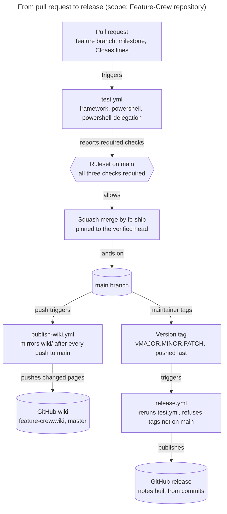

# Development and Release

How a change to Feature-Crew reaches `main`, how a release is cut, and how this wiki is published. The binding rules are in [CLAUDE.md][claude]; this page shows the flow. The diagram was drawn with `/fc-explain`; each node traces to the files in the table below it.

## Pipeline

**Legend:** a rectangle is a step or workflow, the hexagon is a gate, and a cylinder is state GitHub holds. Arrows show what triggers what; each label says what happens along it.

**Takeaway:** everything after `main` is automatic except the tag. Every push to `main` republishes the wiki; a release happens only when a maintainer pushes a version tag, last, because pushing it publishes.

**Walkthrough**

1. **Pull request.** Each work item has an issue in the version's milestone. The PR is assigned to the milestone and closes its issues with `Closes #N` lines.
2. **test.yml** runs on every pull request and every push to `main`. `framework` runs on Ubuntu: the strict suite with pwsh, the wiki publisher test, and a clean-prefix install and uninstall. `powershell` and `powershell-delegation` run on Windows: the PowerShell installer under PowerShell 7 and Windows PowerShell 5.1, and its hand-off to Git Bash.
3. **Ruleset.** The repository ruleset "Require test workflow on main" requires all three checks before a merge.
4. **Merge.** `/fc-ship` squash-merges with `--match-head-commit` and no admin bypass, then confirms the PR shows MERGED and that the merged tree equals the head tree.
5. **Wiki.** `publish-wiki.yml` runs after each push to `main`. It checks out `main` as it is at run time, so re-running an older run cannot publish stale pages. It clones the wiki repository with the job's short-lived token, rebuilds the top-level pages from `wiki/` with `scripts/publish-wiki.sh`, and pushes to the wiki's `master` only when a page changed. Runs are serialized, and only this job may write.
6. **Release.** A maintainer tags `main` as `vMAJOR.MINOR.PATCH` and pushes the tag last. `release.yml` reruns `test.yml`, refuses a tag that is not on `main`, and publishes a release body built from the commits since the previous tag. That body is the only changelog.

| Component | Job | Key files | Evidence |
|---|---|---|---|
| test.yml | Required checks for every PR and every push to `main` | [test.yml][test] | triggers `push` (main), `pull_request`, `workflow_call`; jobs `framework` (ubuntu-latest), `powershell` and `powershell-delegation` (windows-latest) |
| Ruleset | Blocks a merge until the three checks pass | repository settings | GitHub API: ruleset "Require test workflow on main" |
| fc-ship | Merges only the verified head, then cleans up | [fc-ship SKILL.md][ship] | section 5, *Merge* |
| publish-wiki.yml | Mirrors `wiki/` to the GitHub wiki after every push to `main` | [publish-wiki.yml][pubwf], [publish-wiki.sh][pubsh], [test-wiki-publish.sh][pubtest] | job `publish`: serialized, `contents: write` on this job only |
| release.yml | Reruns the tests, then publishes the release body | [release.yml][rel] | trigger: tags `v*`; jobs `test` and `release` |
| Release rules | Milestone, issues, green CI, tag last, no changelog file | [CLAUDE.md][claude] | *Release process* |

## Editing this wiki

Change `wiki/*.md` in the same PR as the behavior it documents. Link pages by page name, for example `[Architecture](Architecture)`, and source files by full GitHub URL. Check locally with `bash scripts/test-wiki-publish.sh`; the strict suite also runs it as T67. After merging, confirm that the `Publish wiki` run for the merge commit succeeded.

## Verified facts, inferences, and unknowns

- **Verified:** the triggers, jobs, and runners, from the workflow files; the ruleset and its three required checks, from the GitHub API.
- **Inferred:** the job's `GITHUB_TOKEN` with `contents: write` can push to the wiki repository; each `Publish wiki` run shows whether it did.
- **Unknown:** none found.

## Where to start reading

1. [test.yml][test]: the required checks.
2. [publish-wiki.yml][pubwf], [publish-wiki.sh][pubsh], and [test-wiki-publish.sh][pubtest]: the wiki pipeline.
3. [release.yml][rel] and the *Release process* in [CLAUDE.md][claude].

[claude]: https://github.com/D0n9X1n/feature-crew/blob/main/CLAUDE.md
[test]: https://github.com/D0n9X1n/feature-crew/blob/main/.github/workflows/test.yml
[pubwf]: https://github.com/D0n9X1n/feature-crew/blob/main/.github/workflows/publish-wiki.yml
[pubsh]: https://github.com/D0n9X1n/feature-crew/blob/main/scripts/publish-wiki.sh
[pubtest]: https://github.com/D0n9X1n/feature-crew/blob/main/scripts/test-wiki-publish.sh
[rel]: https://github.com/D0n9X1n/feature-crew/blob/main/.github/workflows/release.yml
[ship]: https://github.com/D0n9X1n/feature-crew/blob/main/.claude/skills/fc-ship/SKILL.md
